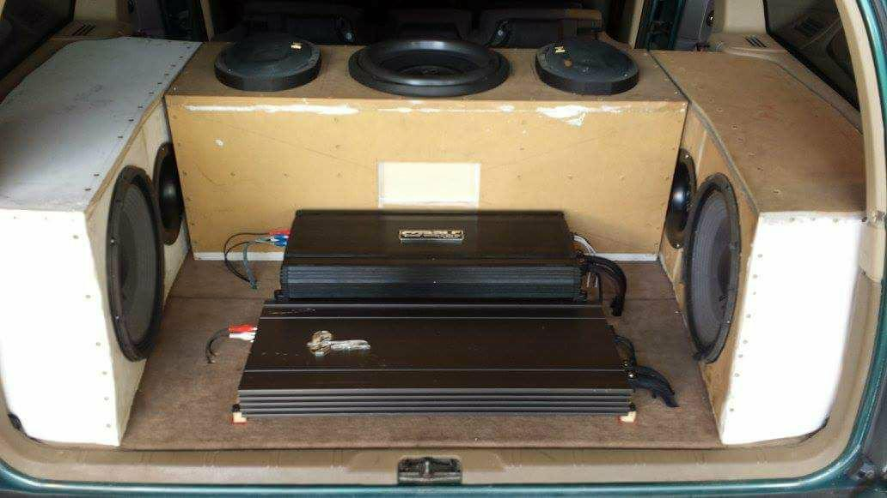
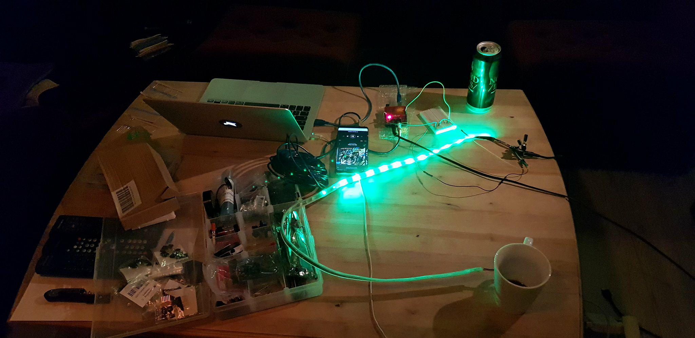
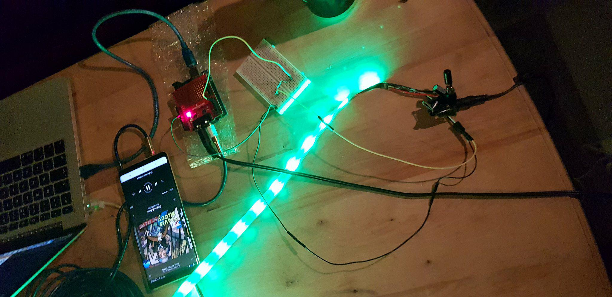
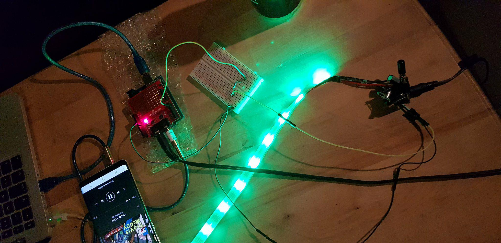

<!--
COMMENT IN -->

	Project 
	

	<h1 style="margin-top: -10px;font-size: 40px; color: green;"> Hulken</h1>

This is a Repository for my Arduino based car stereo project, called Hulken. The Arduino(s) will analyze and divide headunit sound signals, divide the signal in 7 specters. Then the frequenzies will be used to create a visual Equalizer on a 16x32 matrix, and puls EQ-ledstrips with the beat.

## Prosjekt status
### STATUS: Under utvikling
Endelig igang etter å ha funnet tid og motivasjon, etter at _harddisken med alle scripts, tanker, tegninger, osv ble ødelagt_.

Trenger enda ett par ting samt flere ledstrips, men grunnet trang økonomi må dette vente.

## Arkitektur
 **Mistet** pga. **faulty external harddrive**. Så må lage nytt..

## Scripts 
Følgene scripts er de som skal brukes

- `OneStripEQ_noLeds.ino` ( intil jeg har fått kjøpt flere ledstrips. da skal dette **scriptet opdateres** til å håndtere flere)
- `Matrix_spectrum.ino` har **mistet scriptet** for **matrix** pga. **faulty external harddrive**. Så må skrive nytt..

## Bilens system
Bilen har ~13 v —> vi kaller dette 12v i bilens system

### Trenger:
- 12v --> 5v
- 12v --> 9v
- Splitte lydsignal fra headunit slik at det kan gå til forsterkere og arduinoer parallelt og ikke sekvensielt?
- sette sammen splittet lyd til en aux for arduinoer

## Produkter
| Product | Quantity bought | Quantity needed |
| -------- | -------- | -------- |
| Arduino Uno     |  1    |  1    |
| Arduino Mega     |  1    |   1   |
| Adafruit NeoPixel LedStrip 30     |  1    |  3    |
| Adafruit 16x32 Led Matrix Panel     |  1    |  1    |
| Sparkfun Spectrum shield     |  2    |  2    |
| Powersupply for Ledstrip(s) and matrix, during  prototyping and development. (5v,2A)     |  2    |  2    |
| Resistors 300 ~ 500r     |   30   |  3    |
| Capasitors 1000uF     |   20   |  5?    |
| AUX cable(s)     |   1   |  2    |
| AUX splitters     |   0   |  2    |
| AUX combiners     |   0   |  2    |
| Power adapter - 12v -> 9v     |  0    |  1    |
| Power adapter - 12v -> 5v    |   0   |  1    |

## Dokumentasjon under utvikling
### Bilder
#### LedStrips

#### Matrix
#### I bilen

Mer Kommer snart...
### Video
#### LedStrips
<video src="videos/ledStrips_dev_snut.mp4" controls poster="poster.jpg" width="320" height="240" style="border-radius: 50px" />

#### Matrix
#### I bilen

Kommer snart...

## Links
Her lister jeg relevante kilder brukt for mitt prosjekt.

### Resistor color calculator:
- https://www.allaboutcircuits.com/tools/resistor-color-code-calculator/

### Neopixel ledstrip
- **_Docs_**: https://learn.adafruit.com/adafruit-neopixel-uberguide/arduino-library-use
- **_strøm_**: https://learn.adafruit.com/adafruit-neopixel-uberguide/powering-neopixels
- **_Wireing_**: https://learn.adafruit.com/assets/30892 

### Neopixel matrix
- **_Produkt_**: https://www.adafruit.com/product/420

### MSGQ7 spectrum analyzer
- **_Hookup_**: https://learn.sparkfun.com/tutorials/spectrum-shield-hookup-guide 
- **_Examples_**: https://github.com/sparkfun/Spectrum\_Shield

### Arduino
Kommer...

#### Uno
Kommer...

#### Mega
Kommer...

### Unsorted
Her er mange linker som jeg tror kan hjepe meg eller som jeg har brukt. 

- http://tronixstuff.com/2013/01/31/tutorial-arduino-and-the-msgeq7-spectrum-analyzer/
- https://www.tweaktown.com/articles/6437/hands-on-look-at-adafruit-s-neopixel-rgb-led-strip/index.html
- https://www.adafruit.com/product/420
- https://learn.adafruit.com/adafruit-neopixel-uberguide/arduino-library-use
- https://learn.sparkfun.com/tutorials/arduino-shields
- https://www.sparkfun.com/products/13116
- https://learn.sparkfun.com/tutorials/spectrum-shield-hookup-guide
- https://github.com/sparkfun/Spectrum_Shield/tree/HW_1.6_FW_1.1
- https://cdn.sparkfun.com/datasheets/Dev/Arduino/Shields/MSGEQ7_5-11.pdf
- https://cdn.sparkfun.com/datasheets/Dev/Arduino/Shields/Spectrum_Shield_v16.pdf
- https://thebillieblaze.blogspot.com/2014/03/spectrum-analyzer-with-arduino-adafruit.html

