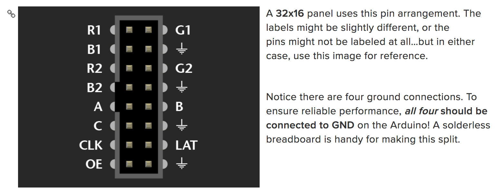

# Adafruit Led matrix 16x32
Produkt information about powering, wireing, etc can be found [here](https://learn.adafruit.com/32x16-32x32-rgb-led-matrix/powering)

## Important notes
The matrix library works only with the following `Arduino boards; Uno and Mega.`, but it will work even better with a more powerfull high speed processor. 

> Keep in mind that these displays are designed to be driven by FPGAs or other high speed processors: they do not have built in PWM control of any kind. Instead, you're supposed to redraw the screen over and over to 'manually' PWM the whole thing. On a 16 MHz arduino, we managed to squeeze 12-bit color (4096 colors) with 20% CPU usage but this display would really shine if driven by any FPGA, CPLD, Propeller, XMOS or other high speed multi-core controller.

## Requirements
The matrix requires certain libraries;

- `RGB Matrix Panel Library` - **rename** to: `RGBmatrixPanel` - [Download from here](https://github.com/adafruit/RGB-matrix-Panel)
- `Adafruit GFX Library` - **rename** to: `Adafruit_GFX` - [Download from here](https://github.com/adafruit/Adafruit-GFX-Library)

> Download both as ZIP files, uncompress and **RENAME** the folder to `RGBmatrixPanel` and `Adafruit_GFX` respectively, place them inside your Arduino libraries folder and restart the Arduino IDE

## Power
- Can draw up up to 4 Amps :: U can never have enough amps available.
- `MAX: 5v` :: Never exceed 5v, then you break it.

## Wireing
### Conecting to Arduino
There are two methods for connecting a matrix to an Arduino:

- `Jumper wires` inserted between Arduino headers and a ribbon cable — this works well for testing and prototyping, but is **not durable**.

- Building a `proto shield` — this is best for **permanent** installations.

These panels are normally run by very fast processors or FPGAs, not a 16 MHz Arduino.

To achieve reasonable performance in this limited environment, our software is optimized by `tying specific signals to specific Arduino pins`.

A `few control lines can be reconfigured, but others are very specific…`you can’t wire the whole thing willy-nilly. 

### Input pins

#### GND
32x16 matrices have four grond wires.

### UPPER RGB data
- `R1`, `G1` and `B1` deliver data to the top half of the display
  - on **Arudino Uno**; connect these to digital pins 2,3 and 4
  - on **Arduino Mega**; connect to pins `24`,`25`,`26`

  
### LOWER RGB data
- `R2`, `G2` and `B2` deliver data to the bottom half of the display
  - on **Arudino Uno**; connect these to digital pins 5,6 and 7
  - on **Arduino Mega**; connect to pins `27`,`28`,`29`

### ROW select Lines
- `A`, `B`, `C`, and `D` select which two rows of the display are currently lit 
 - **NOTE :: (32x16) does not have `D`, it is connected to `GND`**
 - on **Arduino Uno** and **Arduino Mega**; connect to analog pins `A0`, `A1`, `A2` and `GND` <s>(if `D` is present (other matrices such as 32x32) `A3`</s>.

### LAT wire
The LAT (latch) signal marks the end of a row of data
 
 - `LAT` Connect to `A3`, same on both **Arduino Uno** and **Arduino Mega**.

### CLK wire
The CLK (clock) signal marks the arrival of each bit of data.

- `CLK` connects to;
 - **Arduino Uno**: digital pin `8` 
 - **Arduino Mega**: ditial pin `11`

### OE wire
OE (output enable) switches the LEDs off when transitioning from one row to the next.

- `OE` connects to;
 - **Arduino Uno** and **Arduino Mega**: digital pin `9`

### NOTE:
> CLK
> (Any of digital pins 10-13 and 50-53 can be used for this function on the Mega, with the corresponding wiring change. The examples all reference pin 11, as pin 10 may be in use for the 32x32 panel.)

